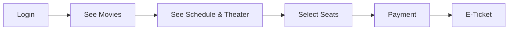
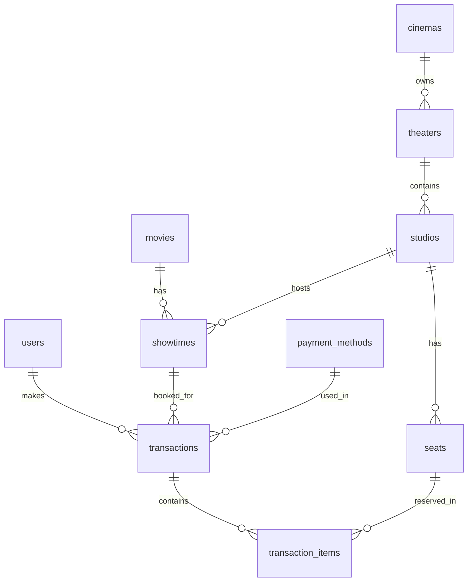

# Filmix Backend

Backend API for Filmix application, built with **Go** and **Fiber**.

## 🚀 Getting Started

### Prerequisites
*   [Go 1.20+](https://go.dev/dl/)
*   [PostgreSQL](https://www.postgresql.org/download/)

### Installation

1.  **Clone the repository**
    ```bash
    git clone https://github.com/senatroxx/filmix-backend.git
    cd filmix-backend
    ```

2.  **Setup Environment Variables**
    Copy `.env.example` to `.env` and adjust the database credentials.
    ```bash
    cp .env.example .env
    ```
    *Make sure your Postgres server is running and the database exists.*

3.  **Run Migrations & Seeder**
    Initialize your database schema and dummy data.
    ```bash
    # Run migrations
    go run main.go migrate up

    # Seed initial data (Users, Cinemas, Movies from TMDB)
    go run main.go seed
    ```

4.  **Run the Server**
    ```bash
    go run main.go serve
    ```
    The server will start at `http://localhost:8080` (or the port defined in `.env`).

5.  **Run with Live Reload (Optional)**
    If you have `air` installed for hot-reloading:
    ```bash
    air
    ```

---

## 🏗️ Project Structure & Flow

This project follows a **Scalable Monolith** structure (Clean Architecture inspired).
If you are coming from a **Mobile Development** background (Flutter/Android/iOS), here is an analogy map:

### 1. API Flow Lifecycle 🔄

1.  **Router (`internal/http/routes`)** 🚦
    *   *Analogi Mobile:* **Navigation Graph**.
    *   Defines the URL endpoints (e.g., `/api/v1/login`) and maps them to Handlers.

2.  **Handler (`internal/http/handlers`)** 🎮
    *   *Analogi Mobile:* **ViewModel / Controller**.
    *   Parses incoming JSON requests.
    *   Validates input.
    *   Calls the **Service**.
    *   Returns JSON response to the client.

3.  **Service (`internal/services`)** 🧠
    *   *Analogi Mobile:* **UseCase / Interactor**.
    *   Contains purely **Business Logic**.
    *   Example: "Check if password matches", "Calculate transaction total".
    *   Coordinates data flow between Handler and Repository.

4.  **Repository (`internal/repositories`)** 🗄️
    *   *Analogi Mobile:* **Repository / DAO**.
    *   Responsible for **Data Access** only (SQL Queries).
    *   The only layer allowed to talk to the Database.

5.  **Database (`internal/database`)** 💾
    *   *Analogi Mobile:* **Local DB (Room/SQLite)**.
    *   Contains Entities (Data Models) and Migrations.

### 2. Key Directories 📂

| Directory | Description | Mobile Analogy |
| :--- | :--- | :--- |
| `cmd/` | Application entry points (Main) | `Application` / `main()` |
| `internal/config/` | Environment configuration | `Config` / `Flavor` |
| `internal/http/handlers` | Request processors | `ViewModel` |
| `internal/http/middleware` | Pre-request logic (Auth, Logging) | `Interceptor` |
| `internal/services` | Business rules | `UseCase` |
| `internal/repositories` | Database queries | `RepositoryImpl` |
| `internal/database/entities`| Database structs | `DataModel` |

### 3. Development Workflow 🛠️

When adding a new feature (e.g., "Add Comment"), work **Inside-Out**:

1.  **Entity**: Define the `Comment` struct in `database/entities`.
2.  **Repository**: Create `CommentRepository` with `Create` method.
3.  **Service**: Create `CommentService` to handle business logic.
4.  **Handler**: Create `CommentHandler` to parse input.
5.  **Route**: Register the endpoint in `routes`.

---

## 🎬 Business Flow (MVP)



---

## 🗄️ Database Schema



### Entity Coverage

| Flow Step | Entities |
|-----------|----------|
| **Auth** | `users`, `roles` |
| **Movies** | `movies`, `movie_statuses`, `movie_ratings`, `movie_genres` |
| **Location** | `cinemas` → `theaters` → `studios` → `seats` |
| **Schedule** | `showtimes` (links movie + studio + pricing) |
| **Booking** | `transactions`, `transaction_items`, `payment_methods` |

---

## 📡 API Documentation

### Quick Setup
```bash
# Get auth token (save for subsequent requests)
export TOKEN=$(curl -s -X POST http://localhost:3000/api/v1/auth/login \
  -H "Content-Type: application/json" \
  -d '{"email": "user@filmix.com", "password": "password"}' | jq -r '.data.access_token')
```

---

### 🔐 Authentication

#### Register
```bash
curl -X POST http://localhost:3000/api/v1/auth/register \
  -H "Content-Type: application/json" \
  -d '{"name": "John Doe", "email": "john@example.com", "password": "password123"}'
```
```json
{ "code": 201, "message": "User registered successfully", "data": { "id": "uuid", "name": "John Doe", "email": "john@example.com" } }
```

#### Login
```bash
curl -X POST http://localhost:3000/api/v1/auth/login \
  -H "Content-Type: application/json" \
  -d '{"email": "user@filmix.com", "password": "password"}'
```
```json
{ "code": 200, "data": { "access_token": "...", "refresh_token": "...", "id": "uuid", "name": "User", "email": "user@filmix.com" } }
```

#### Get Profile
```bash
curl http://localhost:3000/api/v1/auth/me -H "Authorization: Bearer $TOKEN"
```

---

### 🎬 Movies

#### List Movies (Paginated)
```bash
curl "http://localhost:3000/api/v1/movies?page=1&limit=10" -H "Authorization: Bearer $TOKEN"
```

#### Now Playing
```bash
curl "http://localhost:3000/api/v1/movies/now-playing?page=1&limit=10" -H "Authorization: Bearer $TOKEN"
```

#### Get Movie Detail
```bash
curl http://localhost:3000/api/v1/movies/{MOVIE_ID} -H "Authorization: Bearer $TOKEN"
```

---

### 🕐 Showtimes

#### Showtimes by Movie
```bash
curl "http://localhost:3000/api/v1/movies/{MOVIE_ID}/showtimes" -H "Authorization: Bearer $TOKEN"
```

#### Showtimes by Theater
```bash
curl "http://localhost:3000/api/v1/theaters/{THEATER_ID}/showtimes" -H "Authorization: Bearer $TOKEN"
```

#### Get Showtime Detail
```bash
curl http://localhost:3000/api/v1/showtimes/{SHOWTIME_ID} -H "Authorization: Bearer $TOKEN"
```

---

### 💺 Seats

#### Get Seats for Showtime (with availability)
```bash
curl http://localhost:3000/api/v1/showtimes/{SHOWTIME_ID}/seats -H "Authorization: Bearer $TOKEN"
```
```json
{ "code": 200, "data": [{ "id": "uuid", "row": "A", "number": 1, "seat_type": { "name": "Standard" }, "is_booked": false }] }
```

---

### 💳 Payment Methods

```bash
curl http://localhost:3000/api/v1/payment-methods -H "Authorization: Bearer $TOKEN"
```
```json
{ "code": 200, "data": [{ "id": "uuid", "code": "GOPAY", "name": "GoPay", "logo_url": "..." }] }
```

---

### 🎫 Bookings

#### Create Booking
```bash
curl -X POST http://localhost:3000/api/v1/bookings \
  -H "Authorization: Bearer $TOKEN" \
  -H "Content-Type: application/json" \
  -d '{
    "showtime_id": "SHOWTIME_UUID",
    "seat_ids": ["SEAT_UUID_1", "SEAT_UUID_2"],
    "payment_method_id": "PAYMENT_METHOD_UUID"
  }'
```
```json
{
  "code": 201,
  "data": {
    "id": "uuid",
    "status": "pending",
    "invoice_number": "INV-abc123",
    "amount": 100000,
    "expired_at": "2026-01-17T20:00:00Z",
    "showtime": { "id": "...", "time": "...", "movie": { "title": "Avatar" } },
    "theater": { "name": "Theater 1" },
    "seats": [{ "row": "A", "number": 1, "seat_type": "Standard", "price": 50000 }]
  }
}
```

#### List My Bookings
```bash
curl http://localhost:3000/api/v1/bookings -H "Authorization: Bearer $TOKEN"
```

#### Get Booking Detail
```bash
curl http://localhost:3000/api/v1/bookings/{BOOKING_ID} -H "Authorization: Bearer $TOKEN"
```

---

### 🏥 Health Check

```bash
curl http://localhost:3000/live   # Liveness
curl http://localhost:3000/ready  # Readiness (DB check)
```

---
